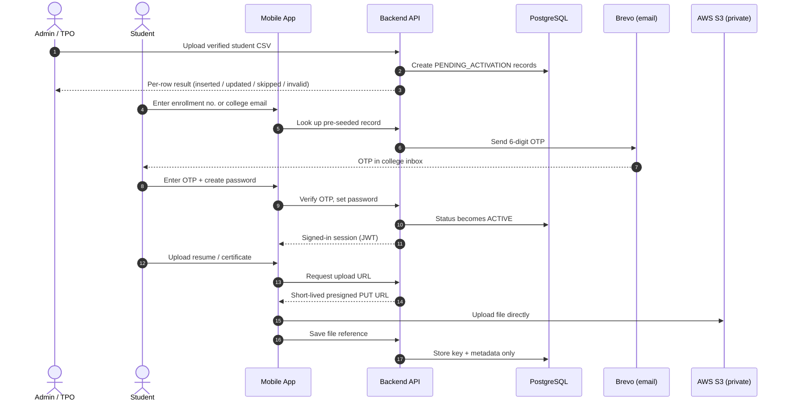
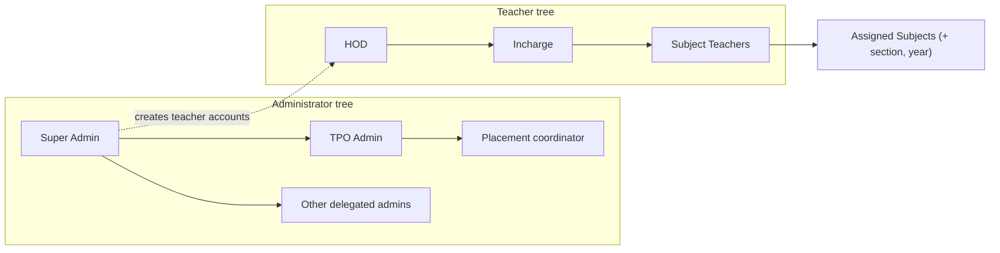
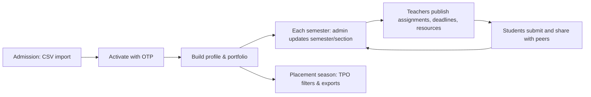

# My GGITS — Management Presentation Kit

**For:** Pitch to GGITS college management (Dean / Principal / TPO / HODs)
**Presenter:** Shubhashish Chakraborty, Lead Developer
**Format:** ~23 slides + appendix, about 20–25 min talking + live demo
**Prices checked:** 8 Oct 2026 (web). Re-verify AWS / Hostinger / Brevo the day before you present.
**Currency assumption:** ₹90 = US$1 (update if the rate has moved)

---

## 0. Read this first (honest flags before you build the deck)

These are things that will either embarrass you in the room or save you if you handle them now.

1. **Apple's $99 is yearly, not one-time.** Only the Google Play $25 is one-time. Put Apple under "ongoing / optional". Apple waives the fee for accredited educational institutions, so if GGITS enrolls as an *organization*, it may cost ₹0. Ask the college.
2. **Publish under the college's developer account, not your personal one.** Management will (rightly) ask "who owns the app?" The answer must be "the college". Google organization accounts need a D-U-N-S number (free to request).
3. **iPhone users can't just "try it".** Without TestFlight (needs the Apple account) they can't install. For Android you can hand out an APK / Play internal-testing link. Decide this before the meeting, and have a plan for iPhone people (e.g. "try on my device, iOS build follows after approval").
4. **KVM 8 is overkill right now.** Your own docs say ~10k students and CRUD-style traffic. KVM 2 covers the pilot, KVM 4 covers the full college. Pitch "start small, scale vertically when metrics say so", not "we need a ₹2,000+/mo server".
5. **"What happens when you graduate?" will be asked** (you're Class of 2028). Have a slide on documentation, team, handover (you have a RUNBOOK, which is a real asset). It's in the Risks slide.
6. **Don't promise what isn't built.** No attendance, fees, push notifications, student chat, or online quizzes (quizzes were deliberately removed — see FAQ). Students never see marks.
7. **Demo ≠ production.** Use a separate demo environment with dummy students, and one pre-made login per role. Your real login needs an OTP to an institutional inbox, which management guests won't want to wait for.
8. **Costs are estimates.** Show ranges and state assumptions on the slide. A confident range beats a fake-precise number.

---

## 1. Design rules for the deck

| Rule | Detail |
|---|---|
| Aspect ratio | 16:9 |
| Theme | Light only (matches the app) |
| Colors | Gold `#F0A83E` (primary/highlights), Forest green `#4C7A3D` (secondary/success), Charcoal `#1c1c1c` (text), Light gray `#f2f3f4` (backgrounds), White `#ffffff` (cards) |
| Fonts | One family only (Inter or Poppins). Titles 32–36 pt, body ≥ 20 pt |
| Density | One idea per slide. Max 5–6 lines. If you need more, it goes in speaker notes |
| Branding | GGITS logo top-right, "My GGITS" footer, slide numbers |
| Visuals | Real app screenshots > icons > bullet text. Management remembers pictures |
| Tone | Institutional and confident, not "hackathon". Say "college-owned platform", not "my app" |

**Time budget (25 min):**

| Section | Slides | Time |
|---|---|---|
| Problem + vision | 1–4 | 3 min |
| Features + how it works | 5–8 | 4 min |
| Demo (video + let them try) | 9 | 5 min |
| Architecture + security | 10–11 | 4 min |
| Feasibility + impact | 12–14 | 4 min |
| Costing | 15–18 | 3 min |
| Rollout, risks, asks | 19–23 | 2 min + Q&A |

---

## 2. Slide-by-slide content

Each slide below has: **On the slide** (what goes visibly), **Say** (speaker notes), **Visual** (what to show).

---

### Slide 1 — Title

**On the slide**
- **My GGITS**
- *One platform for every student's profile, portfolio and academics — from Semester 1 to placement*
- Proposal & live demo for College Management
- Gyan Ganga Institute of Technology & Sciences, Jabalpur
- Presented by: Shubhashish Chakraborty, with the Training & Placement Office
- Date

**Say:** "Today I'll show you what we've built, how it works, what it takes to run it, and what we need from you to roll it out to every student."

**Visual:** GGITS logo + app icon + one clean phone mockup (Home screen).

---

### Slide 2 — The problem today

**On the slide** (title: *"Placement data is collected once, and goes stale"*)
- A Google Form is released per batch, around 5th semester
- Students **cannot edit** their data after submitting
- Every new batch or form change needs a **developer to change code**
- Resumes, certificates and achievements from semesters 1–4 are never captured
- *(Keep only if true at GGITS)* Assignment notices, deadlines and study material are spread across WhatsApp groups

**Say:** "This process worked, but it's one-time and manual. A student who wins a hackathon in 7th semester can't add it. And every new batch means someone editing code."

**Visual:** Simple before-state flow: `Google Form → Sheet → Developer → TPO portal`, with a red "no edits / manual" tag.

---

### Slide 3 — The vision

**On the slide** (title: *"A living profile, from day one to placement day"*)
Three pillars (icons):
1. **Profile & Portfolio** — resumes, certificates, projects, achievements, links, always editable
2. **Academics** — assignments, deadlines, official resources, peer sharing in one tab
3. **Placement-ready data** — TPO filters and exports verified profiles in minutes

Footer line: *College-owned · Data-driven (no hardcoded batches) · Secure by design*

**Say:** "Instead of collecting data once, we keep it alive for all 8 semesters. By placement season it's already complete."

---

### Slide 4 — What is My GGITS?

**On the slide** (title: *"Three experiences, one system"*)

| Experience | Who | What they do |
|---|---|---|
| **Student mobile app** | All students, Sem 1–8, all branches | Maintain profile & portfolio, follow academics, submit assignments, share study material |
| **Teacher panel** (web) | Subject Teachers, Incharges, HODs | Assignments, deadlines, subject resources, grading; HOD/Incharge manage their team |
| **Admin panel** (web) | Super Admin, delegated admins, TPO | Seed students, manage staff & permissions, audit, placement exports |

**Say:** "Same data, three views, each person sees only what their role allows."

**Visual:** Three side-by-side screenshots (phone + two browser windows).

---

### Slide 5 — For students

**On the slide** (title: *"Student app: your portfolio and your semester in one place"*)
- **Profile:** photo, personal details, **two resumes** (technical + non-technical), certificates, projects, achievements (Academic / Co-curricular / Extra-curricular), social links
- **Academics:** Assignments · Deadlines · Resources · Share with Peers
- **Home dashboard:** profile completeness, pending assignments, upcoming deadlines
- No signup: college creates the account, student activates with email OTP

**Say:** "Students own their portfolio. The college owns their academic identity: branch, semester, enrollment number are read-only for students."

**Visual:** 3–4 real screenshots: Home, Profile, Academics, Share with Peers.

---

### Slide 6 — For teachers

**On the slide** (title: *"Teacher panel: less chasing, more teaching"*)
- Create & publish **assignments** with due date and marks; review submissions; late work tracked automatically
- Post **deadlines** (practical file, lab record, project report), so no student misses an in-class announcement
- Organize **official resources**: subject → folder → files
- **HOD / Incharge:** see their team, assign subjects within their branch
- Teachers see only subjects they're assigned to

**Say:** "Teachers manage their own subjects. HODs manage their department's teaching team, and that scope is enforced by the system, not by trust."

**Visual:** Screenshot of assignment detail with the pending / submitted / late breakdown.

---

### Slide 7 — For admin & TPO

**On the slide** (title: *"Admin & TPO: control, visibility, placement-ready data"*)
- **Bulk import** students from the official enrollment CSV (up to 5,000 rows/file) with per-row results
- **Student directory:** filter by branch, semester, admission year, status
- **Placement export:** filtered CSV and time-limited access to resumes/certificates (permission-gated and audited)
- **Permissions:** grant exactly what each person needs; delegate down the hierarchy
- **Audit log:** imports, exports, permission changes and moderation are recorded

**Say:** "The TPO no longer waits for a form cycle. They filter, export and share with companies, and every export is logged."

**Visual:** Student directory with filters + CSV export button.

---

### Slide 8 — How it works (the journey)

**On the slide** (title: *"From college record to placement profile"*), a 5-step horizontal flow:

1. **Seed:** College imports verified students (enrollment no. + institutional email)
2. **Activate:** Student enters enrollment no. → OTP to college email → sets password
3. **Use:** Student builds profile; teachers publish coursework; peers share material
4. **Maintain:** Each semester: admin updates semester/section; new subjects & assignments
5. **Place:** TPO filters, exports and shares with recruiters

Callout: *"No self-registration, so every account maps to a real enrolled student."*

**Say:** "Import is additive and non-destructive. Re-uploading never overwrites an activated student's data."

**Visual:** Chevron/arrow flow, one icon per step.

---

### Slide 9 — Demo

**On the slide** (title: *"See it. Then try it yourself."*)
- Left: embedded **2–3 min screen recording** (see script below)
- Right: **QR code** to install/open the app + "Demo login" card (per role)

**Demo recording script (keep to ≤ 3 min):**

| Time | Show |
|---|---|
| 0:00–0:20 | Admin: log in → import CSV → per-row result (inserted / invalid) |
| 0:20–0:50 | Student: enter enrollment no. → OTP → set password → Home |
| 0:50–1:30 | Student: add photo, upload resume, add certificate & project |
| 1:30–2:00 | Teacher: create & publish assignment, post a deadline |
| 2:00–2:30 | Student: see assignment, submit file; see deadline timeline; open a resource |
| 2:30–3:00 | Admin/TPO: filter by branch + semester → export CSV |

**Live-demo checklist**
- [ ] Separate **demo environment** with dummy students (never real data)
- [ ] One pre-made login per role: Super Admin, TPO, HOD, Teacher, Student (print on a card)
- [ ] Android: signed APK or Play internal-testing link; iOS: TestFlight link **or** plan to show on your device
- [ ] Seed guests' own `@ggits.net` emails in advance *only if* you want them to do real OTP activation
- [ ] Backup: recording on a USB drive + local copy in the deck (Wi-Fi in the room may fail)
- [ ] Test the QR code from the back of the room
- [ ] Warm up the server 10 minutes before (first request after idle can be slow)

---

### Slide 10 — Technical approach & architecture

**On the slide** (title: *"Architecture: simple, secure, college-owned"*)
- Big diagram (build it using Section 3 below)
- Right-side mini table:

| Layer | Technology |
|---|---|
| Student app | React Native + Expo (TypeScript) |
| Admin/Teacher panel | Next.js (TypeScript) |
| API | Node.js + Express (TypeScript) |
| Database | PostgreSQL + Prisma ORM |
| Files | AWS S3, private bucket (Mumbai) |
| Email / OTP | Brevo (transactional) |
| Hosting | VPS with Docker Compose + Caddy (auto HTTPS) |

**Say (60–90 sec):** "Apps talk to one secure API over HTTPS. The API checks who you are and what you're allowed to do on every request. Only metadata lives in the database. Files go straight to a private storage bucket using short-lived links, so they never pass through our server and are never public. OTPs go out by email. Backups run automatically."

**Tip:** For the live slide use the **simplified diagram** in Section 3.9. Keep the full one for the appendix.

---

### Slide 11 — Security, privacy & governance

**On the slide** (title: *"Built for sensitive student data"*)
- **No self-signup;** every account maps to an enrolled student
- **Role + permission checks on the server** (hiding buttons is not the security)
- **Hierarchy:** admins/HODs manage only people below them, never peers or seniors
- **Private file storage:** no public links; files open via expiring signed URLs (~1 hour)
- **Audit trail:** imports, exports, permission changes, moderation
- **Marks are never shown to students;** teachers see marks only for their own subjects
- **Least privilege:** TPO exports require an explicit `EXPORT_STUDENT_PROFILES` grant
- **OTP rate limits:** cooldown, hourly cap, 5 attempts

**Say:** "This holds PII, resumes and academic data for the whole college, so access control and audit were designed in from day one, not added later."

**Also mention (confirm with college legal/IT):** consent and purpose limitation, data-retention policy, breach-response owner — in line with India's DPDP Act 2023.

---

## 3. Architecture diagram: draw.io step-by-step

You'll draw **one full architecture diagram** (3.1–3.8), then a **simplified version** for the slide (3.9). I'm also giving you **Mermaid code** (Section 4) for the sequence and hierarchy diagrams. draw.io can import those, so you don't hand-draw them.

### 3.1 What the diagram shows

Clients (students' phones, staff browsers) → HTTPS → Caddy → Express API (middleware → modules → Prisma) → PostgreSQL; the API also talks to **Brevo** (OTP email) and **S3** (signed URLs); clients upload/download files **directly to S3**; nightly DB backup goes to S3. Eight numbered arrows tell the story.

### 3.2 One-time setup in draw.io

1. Open **app.diagrams.net** (or the desktop app) → **Create New Diagram → Blank Diagram** → name it `MyGGITS-Architecture`.
2. Open the **Format panel** (Ctrl+Shift+P) → **Diagram** tab → tick **Grid**, set **Grid size = 10**, tick **Connection Arrows** and **Connection Points** (default).
3. You'll set exact position/size through the **Arrange** tab → **Geometry** (Left, Top, Width, Height). Coordinates below are in px.
4. **Styling shortcut:** select a shape → **Edit → Edit Style** (Ctrl+E) → paste the style string from 3.3 → Apply. This gives exact colors with no clicking through menus.
5. Add text by double-clicking the shape and typing. Use **Shift+Enter** for a line break inside a shape.

### 3.3 Style presets (paste via Ctrl+E)

| Name | Style string |
|---|---|
| **ZONE** (grey band) | `rounded=1;arcSize=3;whiteSpace=wrap;html=1;fillColor=#f2f3f4;strokeColor=none;verticalAlign=top;align=left;spacingLeft=12;spacingTop=6;fontStyle=1;fontSize=13;fontColor=#555555;` |
| **VPS** (dashed green container) | `rounded=1;arcSize=2;whiteSpace=wrap;html=1;fillColor=#FFFFFF;strokeColor=#4C7A3D;strokeWidth=2;dashed=1;dashPattern=8 4;verticalAlign=top;align=left;spacingLeft=12;spacingTop=6;fontStyle=1;fontSize=14;fontColor=#4C7A3D;` |
| **BACKEND** (inner container) | `rounded=1;arcSize=3;whiteSpace=wrap;html=1;fillColor=#F9FBF7;strokeColor=#4C7A3D;strokeWidth=1.5;verticalAlign=top;align=left;spacingLeft=10;spacingTop=4;fontStyle=1;fontSize=13;fontColor=#1c1c1c;` |
| **CLIENT** (gold) | `rounded=1;whiteSpace=wrap;html=1;fillColor=#FCE3B5;strokeColor=#F0A83E;strokeWidth=2;fontSize=13;fontColor=#1c1c1c;` |
| **SVC** (light green) | `rounded=1;whiteSpace=wrap;html=1;fillColor=#DDEBD6;strokeColor=#4C7A3D;strokeWidth=1.5;fontSize=12;fontColor=#1c1c1c;` |
| **MID** (white, small) | `rounded=1;whiteSpace=wrap;html=1;fillColor=#FFFFFF;strokeColor=#9E9E9E;fontSize=11;fontColor=#1c1c1c;` |
| **EXT** (blue-grey, external) | `rounded=1;whiteSpace=wrap;html=1;fillColor=#E8EEF4;strokeColor=#5B7C99;strokeWidth=2;fontSize=12;fontColor=#1c1c1c;` |
| **DB** (cylinder) | `shape=cylinder3;whiteSpace=wrap;html=1;boundedLbl=1;backgroundOutline=1;size=12;fillColor=#DDEBD6;strokeColor=#4C7A3D;strokeWidth=2;fontSize=12;fontColor=#1c1c1c;` |
| **ARROW** (solid) | `endArrow=block;endFill=1;html=1;rounded=1;edgeStyle=orthogonalEdgeStyle;strokeWidth=2;strokeColor=#1c1c1c;fontSize=11;` |
| **ARROW-FILE** (dashed gold, both ends) | `endArrow=block;startArrow=block;endFill=1;startFill=1;html=1;rounded=1;edgeStyle=orthogonalEdgeStyle;strokeWidth=2;strokeColor=#F0A83E;dashed=1;fontSize=11;` |
| **BADGE** (number circle) | `ellipse;whiteSpace=wrap;html=1;aspect=fixed;fillColor=#1c1c1c;fontColor=#ffffff;fontStyle=1;fontSize=12;strokeColor=none;` |
| **ACTOR** (person) | `shape=umlActor;verticalLabelPosition=bottom;verticalLabelBackgroundColor=none;verticalAlign=top;html=1;outlineConnect=0;fontSize=11;strokeColor=#1c1c1c;` |

### 3.4 Draw the shapes: order matters

**Draw bottom layers first** (zones/containers), then put smaller shapes on top. If a shape hides behind another, select it → **Arrange → To Front** (Ctrl+Shift+F).

**Step A: Title and zones**

| # | Shape | Text | Style | Left | Top | W | H |
|---|---|---|---|---|---|---|---|
| A1 | Text | **My GGITS — System Architecture** (24 pt bold) | none (text only) | 40 | 10 | 900 | 40 |
| A2 | Rectangle | `1 · CLIENTS` | ZONE | 40 | 70 | 1520 | 170 |
| A3 | Rectangle | `2 · HOSTING: VPS · Docker Compose · Ubuntu` | VPS | 40 | 270 | 1000 | 560 |
| A4 | Rectangle | `3 · EXTERNAL SERVICES (managed, outside the VPS)` | ZONE | 1090 | 270 | 470 | 560 |

**Step B: Clients (inside A2)**

| # | Shape | Text | Style | L | T | W | H |
|---|---|---|---|---|---|---|---|
| B1 | Actor | `Students (~10,000)` | ACTOR | 100 | 105 | 30 | 60 |
| B2 | Rectangle | `Student Mobile App` ⏎ `React Native + Expo` ⏎ `Home · Profile · Academics` | CLIENT | 150 | 110 | 360 | 100 |
| B3 | Actor | `Admin · TPO · HOD · Teachers` | ACTOR | 570 | 105 | 30 | 60 |
| B4 | Rectangle | `Admin & Teacher Web Panel` ⏎ `Next.js · TypeScript` ⏎ `Role-based screens` | CLIENT | 620 | 110 | 380 | 100 |

Make the first line of B2 and B4 bold (select text → Ctrl+B).

**Step C: Inside the VPS (A3)**

| # | Shape | Text | Style | L | T | W | H |
|---|---|---|---|---|---|---|---|
| C1 | Rectangle | `Caddy reverse proxy: HTTPS (TLS) · auto SSL · api.<college-domain> → :4000` | SVC | 70 | 320 | 940 | 50 |
| C2 | Rectangle | `Backend API container: Node.js + Express + TypeScript` | BACKEND | 70 | 400 | 940 | 270 |

**Step D: Inside the Backend container (C2)**: *Row 1, request pipeline*

| # | Text | Style | L | T | W | H |
|---|---|---|---|---|---|---|
| D1 | `CORS + rate limits` | MID | 90 | 440 | 210 | 46 |
| D2 | `JWT authentication` | MID | 320 | 440 | 210 | 46 |
| D3 | `Role + permission checks` ⏎ `(grants · hierarchy · subject scope)` | MID | 550 | 440 | 210 | 46 |
| D4 | `Zod validation` ⏎ `(shared schemas)` | MID | 780 | 440 | 210 | 46 |

**Row 2, feature modules** (all SVC, W=168, H=64, Top=500)

| # | Left | Text |
|---|---|---|
| D5 | 90 | `Auth & OTP` ⏎ `activation · login · reset` |
| D6 | 273 | `Students & Profile` ⏎ `CSV import · portfolio` |
| D7 | 456 | `Admins & Teachers` ⏎ `hierarchy · permissions` |
| D8 | 639 | `Academics` ⏎ `assignments · deadlines · resources · peer share` |
| D9 | 822 | `Placement & Audit` ⏎ `exports · audit log` |

**Row 3, data & storage access** (Top=592, H=44)

| # | Text | Style | L | W |
|---|---|---|---|---|
| D10 | `Prisma ORM (database access)` | MID | 90 | 430 |
| D11 | `S3 service: presigned PUT/GET URLs · object delete` | MID | 540 | 450 |

**Step E: Data layer (inside A3, below C2)**

| # | Shape | Text | Style | L | T | W | H |
|---|---|---|---|---|---|---|---|
| E1 | Cylinder | `PostgreSQL 16 (Docker)` ⏎ `users · profiles · branches · subjects · assignments · permissions · audit logs` ⏎ `Metadata + file keys only, no files` | DB | 70 | 700 | 450 | 110 |
| E2 | Rectangle | `Scheduled backup job` ⏎ `pg_dump (daily) → copy to S3 backup prefix` | SVC | 560 | 710 | 450 | 90 |

**Step F: External services (inside A4)**

| # | Text | Style | L | T | W | H |
|---|---|---|---|---|---|---|
| F1 | `AWS S3 — ap-south-1 (Mumbai)` ⏎ `PRIVATE bucket · no public URLs · files open via expiring signed links` ⏎ `students/{id}/photo · resume-tech · resume-non-tech · certificates · achievements · assignments · peer-resources` ⏎ `subjects/{id}/resources` | EXT | 1120 | 330 | 410 | 200 |
| F2 | `Brevo transactional email` ⏎ `OTP for activation & password reset` | EXT | 1120 | 580 | 410 | 100 |
| F3 | `Student / staff inbox` ⏎ `institutional @ggits.net` | EXT | 1120 | 730 | 410 | 70 |

> **If your Next.js panel also runs on the VPS:** add a SVC box `Next.js panel container` inside A3 next to Caddy (shrink Caddy's width to 600 and put the panel at Left 690, W 320). If it's on a separate host (e.g. Vercel), add an EXT box instead and draw the same arrows. **Draw what you actually deploy.**

### 3.5 Draw the arrows

How to draw an arrow: hover over a shape → drag from its blue arrow handle to the target shape (or use a specific connection point), then **Edit Style** → paste the ARROW or ARROW-FILE style. To pin an arrow to a specific side/position, **append** the extra parameters shown in the table to the style string. To add a label, double-click the arrow.

| # | From → To | Style | Extra params to append | Label |
|---|---|---|---|---|
| 1a | B2 (student app) → C1 (Caddy) | ARROW | `exitX=0.5;exitY=1;entryX=0.25;entryY=0;` | `HTTPS · REST/JSON + JWT` |
| 1b | B4 (web panel) → C1 (Caddy) | ARROW | `exitX=0.5;exitY=1;entryX=0.79;entryY=0;` | `HTTPS · REST/JSON + JWT` |
| 2 | C1 (Caddy) → C2 (backend) | ARROW | `exitX=0.5;exitY=1;entryX=0.5;entryY=0;` | `proxy to API` |
| 3 | D2/D3 are inside C2 so **no arrow**: instead put badge ③ on the pipeline row (see 3.6) | — | — | — |
| 4 | D10 (Prisma) → E1 (Postgres) | ARROW | `exitX=0.5;exitY=1;entryX=0.5;entryY=0;` (cylinder top is 0.5, 0) | `SQL via Prisma` |
| 5 | C2 (backend) → F2 (Brevo) | ARROW | `exitX=1;exitY=0.85;entryX=0;entryY=0.5;` | `send OTP (Brevo API)` |
| 6 | F2 (Brevo) → F3 (inbox) | ARROW | `exitX=0.5;exitY=1;entryX=0.5;entryY=0;` | `6-digit OTP email` |
| 7 | C2 (backend) → F1 (S3) | ARROW | `exitX=1;exitY=0.25;entryX=0;entryY=0.7;` | `create signed URLs · delete files` |
| 8a | B2 (student app) → F1 (S3) | ARROW-FILE | `exitX=0.5;exitY=0;entryX=0.5;entryY=0;` | (label on 8b only) |
| 8b | B4 (web panel) → F1 (S3) | ARROW-FILE | `exitX=0.5;exitY=0;entryX=0.5;entryY=0;` | `DIRECT upload (PUT) / download (GET) via short-lived signed URL: files bypass the API` |
| 9a | E1 (Postgres) → E2 (backup) | ARROW | `exitX=1;exitY=0.5;entryX=0;entryY=0.5;` | `dump` |
| 9b | E2 (backup) → F1 (S3) | ARROW | `exitX=1;exitY=0.5;entryX=0;entryY=0.95;` | `backup copy` |

**Arrow 8 routing tip:** both dashed gold arrows leave the *top* of their client boxes and should travel along one horizontal line near y ≈ 90, then drop down at x ≈ 1325 into the top of S3. If draw.io routes them through a box, click the arrow, drag the **yellow midpoint handle** of the horizontal segment up to about y=90. If it still fights you, fallback: draw only **8b**, and add a small note box under S3: *"Files travel directly between the app and S3."*

### 3.6 Number badges (the story)

Add a **BADGE** (26 × 26) next to each arrow/area. Double-click, type the number.

| Badge | Place near | Meaning (put in the legend) |
|---|---|---|
| ① | arrows 1a/1b, just under the client boxes (≈ x 330, y 245 and x 810, y 245) | Client calls API over HTTPS |
| ② | arrow between Caddy and backend (≈ x 545, y 380) | Caddy terminates TLS and forwards to the API |
| ③ | top-left corner of the pipeline row (≈ x 75, y 445) | API verifies **identity (JWT) and permission** on every request |
| ④ | beside arrow Prisma → Postgres (≈ x 315, y 655) | Metadata read/written in PostgreSQL |
| ⑤ | on arrow 5 (≈ x 1065, y 615) | API asks Brevo to send OTP |
| ⑥ | on arrow 6 (≈ x 1330, y 705) | OTP lands in the student's institutional inbox |
| ⑦ | on arrow 7 (≈ x 1065, y 445) | API creates short-lived signed URLs / deletes files |
| ⑧ | on the dashed gold arrow (≈ x 1325, y 300) | Client moves the file **directly** to/from S3 |
| ⑨ | on arrow 9b (≈ x 1065, y 560) | Nightly DB backup copied to S3 |

### 3.7 Legend (bottom)

Draw a rectangle at **Left 40, Top 850, W 1520, H 110**, style `rounded=1;fillColor=#FFFFFF;strokeColor=#9E9E9E;align=left;verticalAlign=top;spacingLeft=10;spacingTop=6;fontSize=12;html=1;whiteSpace=wrap;`. Text:

```
LEGEND
① Client → API over HTTPS (REST + JWT)    ② Caddy → API    ③ Auth + role/permission check on every request
④ API ↔ PostgreSQL (metadata only)    ⑤ API → Brevo (send OTP)    ⑥ OTP → student's college inbox
⑦ API → S3 (signed URLs / delete)    ⑧ App ⇄ S3 direct file transfer (dashed gold)    ⑨ Nightly DB backup → S3
```

Add small swatches if you like: gold box = client apps, green = our services on the VPS, blue-grey = external managed services.

### 3.8 Polish & export

1. Select everything (Ctrl+A) → **Arrange → Align → Distribute** only if something looks off; the coordinates above are already aligned.
2. Check arrows don't cross text: click the arrow and nudge handles.
3. Add a **footer note** (text, 11 pt grey): *"Only metadata is stored in PostgreSQL. Files live in a private S3 bucket and are accessed via expiring signed URLs."*
4. **File → Export as → PNG** → Zoom **200%**, Border width **10**, keep **Transparent Background off**, tick **Include a copy of my diagram**. Also export **SVG** or **PDF** for crisp scaling.
5. Save the `.drawio` file in your repo (e.g. `docs/architecture.drawio`), so the next maintainer can edit it.
6. In PowerPoint/Slides: build the diagram **in layers** (animate: Clients → API → Database/Files → Email → Backups) so you narrate it step by step.

### 3.9 The simplified version (for the live slide)

Management won't read 40 boxes. Build this *second* diagram in 10 minutes and use it on Slide 10:

```
 [ Student App ]        [ Admin / Teacher Panel ]
        \                      /
         ----- HTTPS -----> [ Secure API Server ]
                              (login · roles · permissions · audit)
                              /          |            \
                   [ Database ]   [ File Storage ]   [ Email OTP ]
                  (profiles,       (private, signed   (college inbox)
                   academics)       links, backups)
```

Spec: 6 boxes only. Use CLIENT style for the two apps, SVC for the API, EXT for Database/Storage/Email. Width 300, height 80, spacing 60. Label arrows with one word each ("HTTPS", "data", "files", "OTP").

---

## 4. More diagrams, via Mermaid (paste, don't draw)

In draw.io: **Arrange → Insert → Advanced → Mermaid…** (menu wording can differ slightly by version; if you can't find it, use https://mermaid.live to render and export SVG, then drag the SVG into draw.io or the slide). Paste the code, Insert. You can then restyle shapes.

### 4.1 Activation + file upload sequence



### 4.2 Two separate hierarchies



### 4.3 Student lifecycle across 8 semesters



---

## 5. Feasibility, impact and costing slides

### Slide 12 — Feasibility

**On the slide** (title: *"Feasible today: technically, operationally, financially"*). Use a 2×3 grid:

| Dimension | Message |
|---|---|
| **Technical** | Working system already built on a mainstream, widely supported stack (React Native, Next.js, Node, PostgreSQL, S3). Runs on a single VPS at this scale; no exotic infrastructure |
| **Operational** | Seeded from data the college already has (enrollment register CSV). Roles map to existing positions: TPO, HODs, Incharges, teachers. ~1 hr training per role |
| **Financial** | Total ongoing cost is a few thousand rupees per month (see costing). Development done in-house |
| **Schedule** | Pilot-ready now. College-wide activation can be staged branch by branch |
| **Compliance** | Private storage, audit logs, least-privilege access, retention policy to be agreed with the college |
| **Sustainability** | Documented (runbook, IRL workflow, product doc), standard tech any developer can maintain, team being built |

**Say:** "I'm not asking you to approve an idea; the system exists. I'm asking you to approve a rollout."

**Evidence to attach (add only what you've actually done):**
- [ ] Screenshot of the running production/pilot system
- [ ] A **quick load test** (e.g. k6/Artillery against the demo API: login + list endpoints, ~200–500 concurrent users). One line like "handled N requests/sec on a 2-vCPU VPS" is far stronger than "it scales". *Only claim it if you run it.*
- [ ] Backup restore test done once (you can say "tested restore")
- [ ] List of teachers/TPO who've already tried it

**Capacity framing (safe, no invented numbers):** "~10,000 students is a modest CRUD workload. File traffic goes straight to S3, not through our server, so the VPS isn't the bottleneck."

---

### Slide 13 — Impact & benefits: students

**On the slide** (title: *"For students: one place, always up to date"*)
- **Build the portfolio continuously** from Semester 1; add that hackathon win the day it happens
- **Two resumes** (technical + non-technical) always ready for different opportunities
- **Never miss a deadline or notice:** timeline of practical-file, lab-record and project dates
- **Submit assignments from the phone;** late work is accepted and flagged, not lost
- **Official study material in one place;** teacher-curated, by subject → folder → file
- **Share with peers:** previous-year papers, lab manuals, cheatsheets within class / branch / semester
- **Placement-ready on day one:** no last-minute form scramble
- **Own their data:** edit anytime; academic identity stays college-controlled

**Say:** "A student who starts adding certificates in Semester 2 arrives at placement season with a complete, verified-by-college profile."

---

### Slide 14 — Impact & benefits: TPO, faculty and management

**On the slide** (title: *"For the college: clean data, less manual work, full control"*)

| Stakeholder | Benefit |
|---|---|
| **TPO / Placement** | Filter all students by branch / batch / semester; **export CSV and access resumes & certificates** in minutes; no form cycles; data is **current**, not a one-time snapshot; every export is logged |
| **Faculty** | Assignments, deadlines, and resources in one place; late/pending tracked automatically; less repeating announcements |
| **HOD / Incharge** | See their team; assign subjects within their branch, with scope enforced by the system |
| **Admin / IT** | Bulk import from the official register; per-row validation; non-destructive re-imports; role-based delegation |
| **Management** | Single college-owned system; audit trail; clear accountability; a foundation for future modules (assessments, PYQ, study groups) as the college is now autonomous |
| **Institution** | Stronger placement story: complete, structured student portfolios; data in the college's own control |

**Add (as *proposed KPIs*, not claims):**
- Profile completion rate by semester (target set with TPO)
- Time to prepare a placement shortlist: today vs. with My GGITS (measure it in the pilot)
- % of assignments submitted via the app

> Don't state improvement percentages you haven't measured. "We'll measure these in the pilot" is credible.

---

## 6. Costing

> **How to present:** Three slides: **One-time**, **Ongoing (with a worked traffic example)**, **Summary + per-student view.** State assumptions in small print on every cost slide.

### 6.1 Rates used (as checked 8 Oct 2026)

| Item | Rate | Source note |
|---|---|---|
| AWS S3 Standard, Mumbai (ap-south-1) | ≈ **US$0.025 / GB-month** (≈ ₹2.1/GB) | AWS pricing / AWS partner India page |
| S3 PUT/COPY/POST/LIST | **$0.005 per 1,000** requests | AWS S3 pricing |
| S3 GET | **$0.0004 per 1,000** requests | AWS S3 pricing |
| Data transfer **out** to internet | First ~100 GB/month free (aggregate across AWS), then ≈ **$0.109/GB** in Mumbai | AWS data-transfer pricing — *verify on AWS calculator*, this is the line most likely to shift |
| Data transfer **in** (uploads) | **Free** | AWS |
| Hostinger VPS KVM 2 (2 vCPU / 8 GB / 100 GB NVMe) | **₹800–1,350/mo** (promo ≈ ₹799; global renewal list price $14.99) | Hostinger India / hostinger.com |
| Hostinger VPS KVM 4 (4 vCPU / 16 GB / 200 GB NVMe) | **₹1,100–2,600/mo** (promo ≈ ₹1,099; renewal list $28.99) | same |
| Hostinger VPS KVM 8 | ≈ ₹2,200 promo, renewal ≈ $49.99 (~₹4,500) | same — **not needed now** |
| Brevo email | **Free: 300 emails/day**; paid from ≈ $9/mo (5k) – ≈ $15/mo (20k transactional) | Brevo pricing pages |
| Google Play Console | **US$25 once** | Google |
| Apple Developer Program | **US$99 / year** (fee waived for eligible educational institutions) | Apple |
| GST | Add **18%** to Indian invoices (AWS India, Hostinger India, Brevo may differ) | — |
| Exchange rate | ₹90 = $1 | assumption |

### 6.2 Slide 15: One-time costs

**On the slide** (title: *"One-time costs: under ₹6,000"*)

| Item | Cost | Notes |
|---|---|---|
| Google Play Console developer account | **$25 ≈ ₹2,250** | One-time, never renews. Register under the **college's organization account** (needs a free D-U-N-S number) |
| Launch-month email capacity (activation burst) | **₹1,350–2,700** | ~10,000 students × ~1.3 OTP emails ≈ 13,000 emails in the activation period. Free plan = 300/day. Either stagger activation (≈ 230 students/day → ₹0) or pay for 1–2 months of Brevo's ≈ $15 plan |
| Domain *(only if the college can't give a subdomain)* | ≈ ₹1,000/yr | e.g. `app.ggits.net` is free if the college owns the domain |
| SSL certificate | ₹0 | Automatic via Caddy / Let's Encrypt |
| App development | ₹0 cash | Built in-house. *(Optional: add a line "equivalent market value: ₹___" if you have a defensible estimate)* |
| Initial data seeding | ₹0 | From the college's enrollment register CSV |
| **Total (essential)** | **≈ ₹2,250 – ₹5,000** | |
| **Total incl. domain** | **≈ ₹3,250 – ₹6,000** | |

**Optional one-time extras to mention:** independent security review before college-wide launch (get a quote), launch posters/QR cards for activation.

**Say:** "Play Store is the only true one-time fee. Everything else is a free tier or already running."

### 6.3 Slide 16: Ongoing (recurring) costs, monthly

**On the slide** (title: *"Ongoing: roughly ₹5,000–6,500 per month for the whole college"*)

| Item | Pilot (~1,000 students) | Full college Year 1 (~10,000) | Notes |
|---|---|---|---|
| Hosting VPS | KVM 2: ₹800–1,350 | KVM 4: ₹1,100–2,600 | Already own a KVM 2 → pilot incremental cost ≈ ₹0 |
| AWS S3 (storage + requests + transfer) | ≈ ₹100 | ≈ ₹2,950 | Worked example below |
| Email (OTP) steady state | ₹0 | ₹0 | After activation: password resets + ~new-intake emails fit in the free plan |
| Backups | included | included | Stored in S3 (counted in the S3 line) |
| Monitoring | ₹0 | ₹0 | Free uptime monitor (e.g. UptimeRobot free / self-hosted) |
| **Subtotal** | **≈ ₹900–1,450** | **≈ ₹4,050–5,550** | |
| **+ 18% GST** | **≈ ₹1,060–1,710** | **≈ ₹4,780–6,550** | |
| **Per year** | **≈ ₹13k–20k** | **≈ ₹57k–79k** | |

**Optional / annual:** Apple Developer $99/yr ≈ ₹8,910 (≈ ₹745/mo) — **₹0 if GGITS qualifies for the educational waiver**. Only needed for the iOS App Store / TestFlight.

### 6.4 Slide 17: Worked example, S3 at full-college scale (the "real numbers" slide)

**Assumptions to print on the slide:**

| Assumption | Value |
|---|---|
| Active students | 10,000 |
| Profile data per student (photo ≈ 0.3 MB + 2 resumes ≈ 1 MB + ~5 certificates ≈ 3 MB + achievement proofs ≈ 1.5 MB) | **≈ 6 MB** → **60 GB** |
| Assignment submissions | ≈ 10 MB per student per semester → **100 GB/semester**, **200 GB/year** |
| Peer shares | ≈ 8 GB/month → **~80 GB/year** (file cap 25 MB; 30 posts/day/student max) |
| Teacher resources (all subjects, all branches) | **≈ 50 GB** |
| DB backups (rolling copies) | **≈ 10 GB** |
| **Storage at end of Year 1** | **≈ 400 GB** |
| Uploads in a busy month (onboarding + submissions) | **≈ 150,000 PUT requests** |
| File opens per month (resources, peer files, photos) | **≈ 60 per student → 600,000 GET requests** |
| Data downloaded per student per month | **≈ 30 MB → 300 GB/month** (100 GB free → 200 GB billable) |

**Worked cost (busy month, end of Year 1):**

| Line | Calculation | US$ | ₹ (@90) |
|---|---|---|---|
| Storage | 400 GB × $0.025 | $10.00 | ₹900 |
| PUT requests | 150,000 ÷ 1,000 × $0.005 | $0.75 | ₹68 |
| GET requests | 600,000 ÷ 1,000 × $0.0004 | $0.24 | ₹22 |
| Data transfer out | (300 − 100 free) GB × $0.109 | $21.80 | ₹1,962 |
| Data transfer in (uploads) | free | $0 | ₹0 |
| **S3 total** | | **≈ $32.80** | **≈ ₹2,950** |

**Three scenarios, S3 only:**

| Scenario | Students | Storage | Uploads/mo | Opens/mo | Download/mo | ≈ Monthly S3 |
|---|---|---|---|---|---|---|
| **Pilot** (one batch) | 1,000 | 40 GB | 15,000 | 60,000 | 30 GB (inside free 100 GB) | **$1.10 ≈ ₹100** |
| **Full college, Year 1** | 10,000 | 400 GB | 150,000 | 600,000 | 300 GB | **$32.80 ≈ ₹2,950** |
| **Year 4 (mature)** | 10,000 | ~1,200 GB | 150,000 | 600,000 | 300 GB | **$52.80 ≈ ₹4,750** |

**Key insight to say out loud:** "Storing the files is cheap — about ₹900 for 400 GB. The bigger line is **data downloaded** by students. We control it with file-size caps, image compression on the phone, and, if needed, a CDN with a free allowance."

**Cost guardrails (also on the slide, small):**
- AWS Budgets alert (e.g. at ₹3,000 and ₹5,000/month)
- Lifecycle rules: move old submissions to cheaper storage after a year (Standard-IA ≈ ₹1.15/GB vs ₹2.1/GB)
- Upload caps: 25 MB per peer file, 30 posts/day per student, client-side image compression
- Optional CDN in front of S3 if downloads grow (CloudFront has a monthly free transfer allowance; verify the current size)

### 6.5 Slide 18: Cost summary & per-student view

**On the slide** (title: *"≈ ₹8 per student per year"*)

| | Pilot | Full college, Year 1 | Year 4 (mature) |
|---|---|---|---|
| One-time | ≈ ₹2,250–5,000 | (already paid) | — |
| Monthly (incl. GST) | ≈ ₹1,060–1,710 | ≈ ₹4,780–6,550 | ≈ ₹8,700 *(KVM 4 ₹2,600 + S3 ₹4,750, +18% GST)* |
| Yearly | ≈ ₹13k–20k | ≈ ₹57k–79k | ≈ ₹1.04 lakh |
| **Per student / year** | — | **≈ ₹5.7–7.9** | **≈ ₹10.4** |
| Optional: Apple | +₹8,910/yr (waivable) | | |

**Say:** "For roughly the price of a single textbook for the entire college per year, we replace a manual placement workflow and give every student a living portfolio."
*(Only keep the textbook line if you're comfortable with the comparison. A softer version: "less than ₹1 per student per month".)*

**Footnotes on the slide:**
- Estimates; actual usage will be monitored monthly and reported
- Prices from provider pages as of Oct 2026, converted at ₹90/US$; GST at 18%
- Not included: staff time (TPO data entry, one maintainer/admin), optional paid support or security audit
- Development is in-house and not billed

> **Honest note for you:** the human cost is real — someone must administer the system (imports, account fixes, support). Management will think of it even if you don't say it. Name it: "one nominated system owner + one backup in the TPO office."

---

## 7. Rollout, risks, asks and close

### Slide 19 — Proposed rollout (adjust to your reality)

| Phase | When | What |
|---|---|---|
| **0. Approval** | This week | Management approves pilot; nominate system owner; confirm domain, developer account owner |
| **1. Pilot** | ~4–6 weeks | One or two cohorts (≈ 1,000 students) + a few teachers/HOD + TPO. Gather feedback, fix issues, measure KPIs |
| **2. College-wide activation** | Following 4–8 weeks | Branch-by-branch activation, staggered (keeps OTP email volume manageable); department help desks |
| **3. Placement season** | As scheduled | TPO uses filters + exports; first real placement cycle on live data |
| **4. Enhancements** | Ongoing | Based on feedback (e.g. proctored assessments, PYQ section, study groups) |

---

### Slide 20 — Risks & mitigations

| Risk | Mitigation |
|---|---|
| **Single maintainer / bus factor** | Runbook + docs already written; standard stack; build and train a small student maintainer team; code in college-owned repo; handover checklist |
| **Data privacy / misuse of exports** | Least-privilege grants; audit logs; exports limited to authorized TPO staff; retention & sharing policy agreed with the college |
| **Wrong or stale student records** | Admin-managed academic fields; non-destructive re-import; clear correction process via departments |
| **Email OTP delivery issues** | Verified sender domain; staggered activation; resend cooldown; helpdesk path for wrong emails |
| **Server outage / data loss** | Automated Postgres backups to S3; tested restore; uptime monitoring |
| **Cost creep (storage / downloads)** | Budget alerts, size caps, lifecycle rules, optional CDN |
| **Low adoption** | Pilot with TPO/HOD sponsorship; department-level onboarding sessions; teachers publish coursework in-app so students have a reason to open it daily |
| **App store ownership / account loss** | Register under the college's organization account, with 2 admins |

---

### Slide 21 — What we need from management (the asks)

1. **Approve the pilot** and the proposed rollout plan
2. **Nominate a system owner** (and a backup) in the TPO office / IT cell
3. **Confirm the official student data source** (enrollment register CSV) and a contact for corrections
4. **Provide the institutional setup:** domain/subdomain (e.g. `app.ggits.net`), college **organization** accounts for Google Play (and Apple, if iOS is wanted), and approved budget line (~₹5,000–6,500/month at full scale)
5. **Endorse the data-handling policy** (who may export, retention, sharing with recruiters)
6. **Authorize student maintainer team** and time slots for training sessions

---

### Slide 22 — Future scope *(clearly labeled as future, not built)*

- Proctored, in-classroom assessments *(the earlier unproctored online-quiz version was deliberately removed, since AI tools make unsupervised results meaningless)*
- Previous-year-question (PYQ) section, study groups, Q&A
- Insights dashboards for TPO / management (profile completeness, branch-wise readiness)
- Push notifications, attendance, etc. — only if the college wants them

*Everything new lands as a section inside the Academics tab, not as another top-level menu.*

---

### Slide 23 — Thank you / Try it now

- **QR code** + short URL to install/open the app
- Demo credentials card (per role)
- Contact: name · email · phone
- "Questions?"

---

## 8. Appendix slides (keep hidden, pull up if asked)

- **A1:** Full architecture diagram (Section 3)
- **A2:** Activation + file-upload sequence diagram (Section 4.1)
- **A3:** Two hierarchies diagram (Section 4.2)
- **A4:** Permission model (table below)
- **A5:** Full costing assumptions (Section 6.1 + 6.4)
- **A6:** S3 folder layout and security (private bucket, signed URLs)

**A4: Permission model (summary):**

| Permission | Purpose |
|---|---|
| `MANAGE_ADMIN_HIERARCHY` | Create/manage child admins |
| `MANAGE_STUDENTS` / `VIEW_STUDENTS` | Import, edit, browse students |
| `EXPORT_STUDENT_PROFILES` | Placement export and full profile access (audited) |
| `MANAGE_ACADEMIC_STRUCTURE` | Branches and subjects |
| `MANAGE_TEACHERS` / `MANAGE_TEACHER_ASSIGNMENTS` | Staff accounts / subject assignments |
| `CREATE_ASSIGNMENT` | Create and publish assignments |
| `MODERATE_PEER_RESOURCES` | Remove inappropriate peer posts |
| `VIEW_STUDENT_EMAIL` / `VIEW_STUDENT_MOBILE_NUMBER` | Unmask contact fields |
| `VIEW_STUDENT_MARKS` | Marks outside a teacher's own subjects (off by default) |
| `VIEW_AUDIT_LOGS` | Read the audit trail |

Super Admin has all; nobody can grant a permission they don't hold.

---

## 9. Likely questions from management, with answers

**1. Who owns the data and the app?**
The college. The database, S3 bucket, domain and store accounts sit under college-controlled accounts. Source code lives in a college-owned repository. *(Make this true before you say it.)*

**2. What if you graduate or leave?**
The system is documented (runbook, workflow guide, product doc), uses a mainstream stack, and a student maintainer team is being built. Request a faculty/IT-cell system owner for continuity.

**3. How do you keep student data safe?**
No public file links, expiring signed URLs, role and permission checks on the server, audit logs, OTP rate limits, least-privilege grants, and backups. Add: retention policy to be agreed.

**4. Can students see each other's personal data?**
No. Peer sharing is limited to study files/links within class/branch/semester. Profiles are visible to students themselves and to authorized staff.

**5. Can teachers see marks of other subjects?**
No. Teachers see marks only in their own assigned subjects. Cross-subject visibility needs an explicit permission, off by default. Students don't see marks at all in the app.

**6. What if a student enters fake information?**
Identity and academic fields (enrollment, branch, semester) are college-controlled. Portfolio content (certificates, projects) is student-entered; the TPO can review supporting files, and the college can set a verification policy.

**7. What about recruiters, how do they get data?**
TPO filters and exports through an authorized, audited process and shares per college policy. Recruiters don't log into the system.

**8. What if the server goes down?**
Automated backups to S3; uptime monitoring; documented restore; the stack redeploys from Docker Compose. *(Run a restore test before the meeting.)*

**9. Will it scale to all 10,000 students?**
The workload is modest, and file traffic bypasses the API by going directly to S3. Start with a pilot, monitor, and scale the VPS vertically if needed.

**10. Why not buy a ready-made ERP / placement software?**
Keeps data and roadmap under college control, matches GGITS's own workflow (branch codes, enrollment format, hierarchy), and avoids per-student licence fees. *(Avoid quoting competitors' prices unless you have actual quotes.)*

**11. Why were online quizzes removed?**
Unproctored online quizzes can't be trusted: students can use AI tools. A deliberate decision. If assessments return, they'll be proctored and in-classroom.

**12. Is there attendance / fees / notifications?**
Not currently. Scope is profile & portfolio, assignments, deadlines, resources and peer sharing. Others are future scope if the college wants them.

**13. What does iOS cost?**
Apple's program is $99/year (≈ ₹8,910), waived for eligible educational institutions. Android requires a one-time $25 fee.

**14. What if usage and costs grow?**
Budget alerts, size caps, lifecycle rules, and a CDN option. Costs scale roughly with downloads and storage, not with the number of logins.

**15. What do you need from us?**
See Slide 21.

---

## 10. Final checklist: the week before

- [ ] Build the deck from Sections 2, 5, 6, 7 (23 slides; hide the appendix)
- [ ] Draw the full architecture in draw.io (Section 3) + the simplified version (3.9); export PNG at 200%
- [ ] Record the 3-minute demo; keep an offline copy
- [ ] Set up the demo environment with dummy data + one login per role
- [ ] Android install path ready (APK / internal testing); iOS plan decided
- [ ] Re-check AWS/Hostinger/Brevo prices on the day before
- [ ] Run a quick load test and a backup-restore test (only claim what you've done)
- [ ] Agree with the TPO who presents which part, and get their endorsement line for Slide 21
- [ ] Rehearse once with a timer (target 20–25 min + demo)
- [ ] Print: one-page cost summary + demo credential cards
- [ ] Prepare a "what to do if Wi-Fi fails" plan (video + screenshots)

---

## 11. Source notes (for your reference, not for the slides)

- AWS S3 pricing (Mumbai standard-storage rate ≈ $0.025/GB; PUT $0.005 and GET $0.0004 per 1,000 requests): AWS S3 pricing page, enterprisestorageforum.com and cloudian.com summaries; India rate ≈ ₹2.10/GB from precisiontech.in AWS India guide
- Hostinger VPS (India promo prices, renewal list prices): hostinger.com/vps-hosting, zoutons.com Hostinger India pages (June–Aug 2026)
- Brevo (free 300 emails/day; paid plans from ≈ $9/mo): Brevo pricing summaries (moosend.com, ecommerce-platforms.com, hackceleration.com)
- Google Play ($25 one-time) and Apple ($99/year, educational-institution waiver): splitmetrics.com, choicely.com, playcode.io (read Aug 2026)
- Data-transfer-out rates and CloudFront free allowance are from general AWS knowledge. **Confirm on the AWS Pricing Calculator before presenting.**